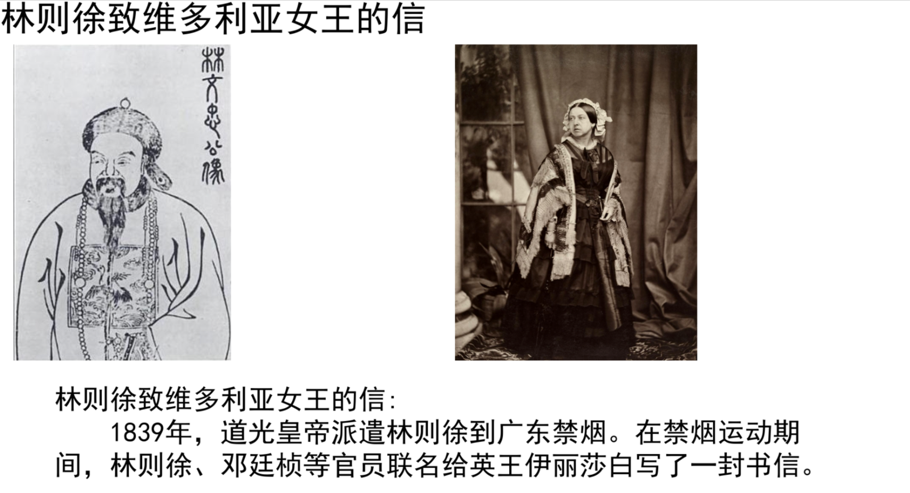

# 1. 技术方案

在[movie-daily-news](https://github.com/deipss/moviepy-daily-news)项目的基础，
将目光放在自己运营的内容上，技术线和上一线项目一致。
将md文件转换成视频，

- 使用`markdown`包，将md解析出来
- 文字转语音:刚开始打算使用[字节的megaTTS](https://github.com/bytedance/MegaTTS3)，8G的显示不够，使用微软的edge-tts，效果还可以。
- 视频生成：将md中的图片、文本以及语音，使用moviepy生成视频

# 2. 信息来源

主要是通过不同的AI平台，提问，自己收集图片、文本、历史纪录等信息，

# 3. 使用

将每个视频的素材，放在`letters`目录下，每个素材的目录下，有对应的图片和文字素材。

- 每个素材的目录名，就是视频的名字。
- 每个素材的目录下，有对应的图片和文字素材。

# 4. 效果

以下生成的视频截图



# 5. todo

- [ ] 主色调确定、头像
- [x] 主要排版
- [x] 脚本安排：总-分-总
- [x] 片头，片尾
- [x] 音频声色确定：男声
- [ ] Gradio 进行交互界面
- [ ] 字幕
- [x] 找一个完全的素材，进行测试
- [x] 视频的预览
- [ ] ~~对于一些素材，需要手动修改，比如图片的尺寸，看html5的自适应是如何实现的。~~

# 6. 附件

外层的数据样例：

```json
[
  {
    "idx": 1,
    "letter": "林则徐致维多利亚女王的信:",
    "description": "林则徐致维多利亚女王的信:",
    "generated": false,
    "is_deleted": false,
    "date": "20250610"
  }
]

```

主体内容的数据样例：

- 当图只有一张时，quotes[0]在图的右边，下方是语音的文本；
- 当图只有2张时，quotes[0]和[1]都在图的下方。

```text
[
  {
    'images': [
      'img_2.png',
      'img_13.png'
    ],
    'quotes': [
      '林则徐致维多利亚女王的信:',
      '1839年，道光皇帝派遣林则徐到广东禁烟。在禁烟运动期间，林则徐、邓廷桢等官员联名给英王伊丽莎白写了一封书信。'
    ],
    'texts': [
    ],
    'title': '林则徐致维多利亚女王的信'
  },
  {
    'images': [
      'img.png',
      'img_1.png'
    ],
    'quotes': [
      '林则徐（1785年8月30日—1850年11月22日），福建省福州府侯官县左营司巷（今福州市鼓楼区）人 ，字元抚，又字少穆，家族为文山林氏。是清朝后期政治家、思想家、文学家、改革先驱、诗人、学者、翻译家。1811年林则徐（26岁）中进士，后曾官至一品，曾经担任湖广总督、陕甘总督和云贵总督，两次受命钦差大臣。',
      '维多利亚女王（英文：Queen Victoria；1819年5月24日—1901年1月22日），全名亚历山德丽娜·维多利亚（Alexandrina Victoria），1837年6月20日即位为英国女王，1876年成为印度女皇，是唯一拥有女皇头衔的英国女性君主。她统治期间被称为维多利亚时代，是英国在工业、文化、政治、科学与军事都取得相当大发展的时期，伴随而来的是大英帝国的巅峰全盛时期。'
    ],
    'texts': [
    ],
    'title': '人物简介'
  },
  {
    'images': [
      'img_10.png'
    ],
    'quotes': [
      '这幅画描绘的应是虎门销烟场景。虎门销烟发生于1839年6月，是林则徐在广东虎门集中销毁鸦片的历史事件 ，是中国近代史上反对帝国主义的重要史例，也是人类禁烟史上旷古未有的壮举。虎门销烟展示了中国人民反抗侵略、维护民族尊严的坚定决心，唤醒了当时众多爱国的有识之士，同时也在一定程度上遏制了鸦片在中国的泛滥，对世界禁毒史产生了深远影响。'
    ],
    'texts': [
      '1839年道光帝派林则徐赴粤禁烟，源于多重历史困局：一方面，英国为扭转对华贸易逆差，大规模走私鸦片，导致中国白银外流、银贵钱贱，财政濒临崩溃，且鸦片泛滥腐蚀军民体质，统治危机加深。清廷内部“严禁派”力陈危害（如林则徐“兵银俱缺”之警示），促使道光帝决...负担倍增，手工业受洋货冲击破产，加之水患频发， 饥荒蔓延。社会层面，鸦片成瘾者超200万，家庭破产、犯罪激增，阶级矛盾尖锐，小规模起义不断（如湖南瑶族起义），民间疾苦深重。 于是，便有了时间为 1839年6月3日至6月25日，时长持续23天的虎门销烟。'
    ],
    'title': '历史背景'
  }
]

```

# 7. 其它

关于素材的整理、上下文的连贯等内容方面的信息，刚上手时，觉得非常地艰难，处处都不满意。这不是坏事，
自己在追求更好的效果。只是时间成本很高。