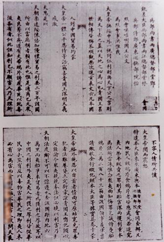
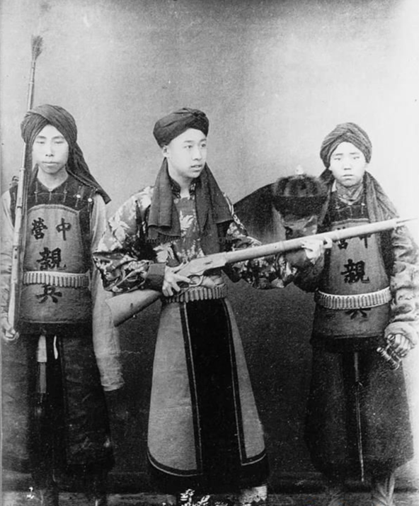
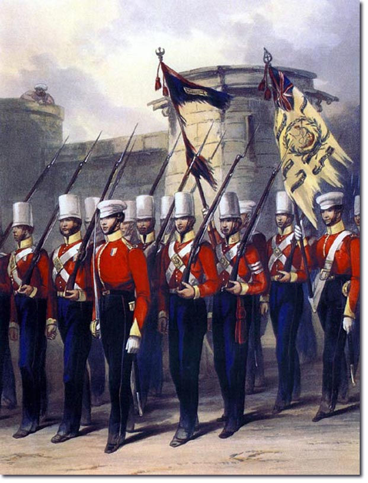

### 参考文献

1839年12月16日湖广总督林则徐接见了几位英国人，并托一名叫Hill的英人将一封写好的、呈交英国女王Alexandrina
Victoria的国书原文及全部英文原稿（此信送达英国议会成了个大笑话，未能交付英女王处）

- https://www.bilibili.com/opus/549082487573017456
- https://zh.wikipedia.org/wiki/File:Letter_by_Lin_Zexu_to_Queen_Victoria_of_the_United_Kingdom.jpg

## 林则徐致维多利亚女王的信

> 《林则徐致维多利亚女王的信》

> 1839年，道光皇帝派遣林则徐到广东禁烟。在禁烟运动期间，林则徐、邓廷桢等官员联名给英王伊丽莎白写了一封书信。

## 人物简介

> 开始信件的内容之前，先简单介绍下信件中，两位主要人物的背景。林则徐：1785年8月30日—1850年11月22日，福建省福州府侯官县左营司巷，
> 今福州市鼓楼区人 ，字元抚，又字少穆，家族为文山林氏。是清朝后期政治家、思想家、文学家、改革先驱、诗人、学者、翻译家。
> 1811年,26岁的林则徐高中进士，后曾官至一品，曾经担任湖广总督、陕甘总督和云贵总督，两次受命钦差大臣。

> 维多利亚女王，1819年5月24日—1901年1月22日，全名亚历山德丽娜·维多利亚（Alexandrina Victoria），
> 1837年6月20日即位为英国女王，1876年成为印度女皇，是唯一拥有女皇头衔的英国女性君主。她统治期间被称为维多利亚时代，
> 是英国在工业、文化、政治、科学与军事都取得相当大发展的时期，伴随而来的是大英帝国的巅峰全盛时期。

## 历史背景

> 虎门销烟场景图。虎门销烟发生于1839年6月，是林则徐在广东虎门集中销毁鸦片的历史事件 ，
> 是中国近代史上反对帝国主义的重要史例，也是人类禁烟史上旷古未有的壮举。虎门销烟展示了中国人民反抗侵略、维护民族尊严的坚定决心，
> 唤醒了当时众多爱国的有识之士，同时也在一定程度上遏制了鸦片在中国的泛滥，对世界禁毒史产生了深远影响。

这封信的历史背景发生在1839年，道光帝派林则徐赴粤禁烟。一方面，英国为扭转对华贸易逆差，大规模走私鸦片，导致中国白银外流、
银贵钱贱，财政濒临崩溃，且鸦片泛滥腐蚀军民体质，统治危机加深。清廷内部“严禁派”力陈危害，林则徐警示“兵银俱缺”，促使道光帝决心禁烟。
此时英国已完成工业革命， 急需开拓中国市场，鸦片问题成为中英矛盾激化的导火索。另一方面民生经济濒临崩溃：农民因银价暴涨赋税负担倍增，
手工业受洋货冲击破产，加之水患频发， 饥荒蔓延。社会层面，鸦片成瘾者超200万，家庭破产、犯罪激增，阶级矛盾尖锐，小规模起义不断
（如湖南瑶族起义），民间疾苦深重。 于是，便有了时间为 1839年6月3日至6月25日，时长持续23天的虎门销烟。期间，林则徐写信给英国女生陈述：
贵国王诚能于此等处拔尽根株，尽锄其地，改种五谷。希望可以将孟加拉、马德拉斯、孟买、巴特那、马尔瓦等地的大麻改种粮食。

## 贸易之利，垂二百年

> 洪惟我大皇帝抚绥中外，一视同仁，利则与天下公之，害则为天下去之。盖以天地之心为心也。贵国王累世相传，皆称恭顺。观历次进贡表文云：
> 凡本国人到中国贸易，均蒙大皇帝一体公平恩待等语。窃喜贵国王深明大义，感激天恩，是以天朝柔远绥怀，倍加优礼。贸易之利，
> 垂二百年。该国所由以富庶称者，赖有此也。

开文第一段，林则徐先在信中表述大清皇帝仁爱中外，对待所有人都一视同仁，有利于天下的事情就与天下人共享，有害于天下的事情就会为天下人去除。
这是以天地的公心为己心。你英国国王世代相传，一直都称臣恭顺。从历次的进贡表文中可以看到，你们曾表示：“凡是本国人民到中国来贸易，
都蒙大皇帝一视同仁，公平恩待。”林则徐对此深感欣慰，说明贵国国王明白道义，感恩皇恩。正因如此，天朝才会怀柔远方，加强恩礼，给予特别优待。
两国之间的贸易往来已有近二百年，这也是贵国能够富庶强盛的一个重要原因。

## 既不使为害于该国，则他国尚不可移害，况中国乎

> 特遣本大臣来至广东，与本总督部堂巡抚部院，会同查办。凡内地民人贩食者，皆应处死。若追究夷人历年贩卖之罪，则其贻害深而攫利重，本为法所当诛。
> 惟念众夷尚知悔罪乞诚，将趸船二万二百八十三箱，由领事官义律，禀请缴收，全行毁化。叠经本大臣等据实具奏。幸蒙大皇帝格外施恩，
> 以自首者，情尚可原，姑宽免罪。再犯者法难屡贷，立定新章。谅贵国王向化倾心，定能谕令众夷，兢兢奉法。但必晓以利害，乃知天朝法度，
> 断不可以不懔遵也。查该国距内地六七万里，而夷船争来贸易者，为获利之厚故耳。以中国之利利外夷，是夷人所获之厚利，皆从华民分去。
> 岂有反以毒物害华民之理。即夷人未必有心为害，而贪利之极，不顾害人，试问天良安在？闻该国禁食甚严，是固明知之为害也。
> 既不使为害于该国，则他国尚不可移害，况中国乎？

林则徐奉大清皇帝的命令，被特派到广东，
与广东总督、巡抚等官员一起联合查办鸦片之事。凡是中国内地的百姓贩卖鸦片的，一律依法处死。
若要追究你国商人这些年来贩卖鸦片的罪行，他们带来的祸害深重、牟取的利润巨大，按法律也应当处以极刑。
但念在这些外国人现在已经悔罪并表示真诚忏悔，愿意由你国驻华领事义律出面，把库存的鸦片——共二万二千八百三十三箱——全数上缴，
由我们收回并全部销毁。本大臣等据实向皇帝奏报。皇上格外开恩，念其是主动投案，情有可原，
于是暂时宽免其罪。但若再犯，法律不能一而再、再而三宽恕，因此我们已重新制定严厉的新法。

## 中国曾有一物为害外国否

> 中国所行于外国者，无一非利人之物。利于食，利于用，并利于转卖，皆利也。中国曾有一物为害外国否？况如茶叶大黄，外国所不可一日无也。
> 中国若靳其利而不恤其害，则夷人何以为生？又外国之呢羽哔叽，非得中国丝斤不能成织。若中国亦靳其利，夷人何利可图？其余食物，自糖料姜桂而外，
> 用物自绸缎磁器而外，外国所必需者，曷可胜数。

信中质问：中国出口到外国的东西，没有一样不是对外国人有益的物品。这些物品有的有利于食用，有的有利于使用，还有的有利于转卖获利，
方方面面都是对外国人有好处的。中国可曾有过一样物品对外国造成危害吗？就拿茶叶和大黄来说，外国人一天都离不开它们。如果中国吝惜这些利益，
而不考虑外国人的死活，那么外国人该如何生存呢？另外，外国的呢绒、羽纱、哔叽等纺织品，如果没有中国的蚕丝就无法织成。要是中国也吝惜这些利益，
外国人又能从哪里谋取利润呢？除此之外，在食物方面，除了糖料、姜、肉桂等；在用品方面，除了绸缎、瓷器等，外国所必需的中国物品，多得数都数不清。

## 何忍更以害人之物，恣无厌之求乎

> 而外来之物，皆不过以供玩好，可有可无。既非中国要需，何难闭关绝市。乃天朝于茶丝诸货，悉任其贩运流通，绝不靳惜。无他，利与天下公之也。
> 该国带去内地货物，不特自资食用，且得以分售各国，获利三倍。即不卖，而其三倍之利自在。何忍更以害人之物，恣无厌之求乎？
> 设使别国有人贩至英国，诱人买食；当亦贵国王所深恶而痛绝之也。

而外国输入中国的物品，不过是一些供人玩赏的东西，可有可无。既然不是中国的必需之物，那么中国要闭关绝市又有什么难的呢？然而，
天朝对于茶叶、丝绸等货物，都任由外国人贩运流通，毫不吝惜。这没有别的原因，只是因为我们愿意与天下人共享利益。外国人把中国的货物带到海外，
不仅自己可以使用，还能分销到其他国家，从中获得三倍的利润。即便他们不转卖，这三倍的利润也是实实在在存在的。对，足足三倍利润，
原文如下：该国带去内地货物，不特自资食用，且得以分售各国，获利三倍。即不卖，而其三倍之利自在。

## 今天的世界

> 反观今天的世界:自2013年，
> 乌拉圭成为世界上第一个将娱乐用大麻的种植、销售和使用完全合法化的国家。
> 2018年10月17日，加拿大全国范围内将娱乐用大麻合法化。
> 2018年9月，南非宪法法院判决个人使用大麻合法，但具体的法律框架仍在制定中。从2024年4月1日起，德国开始合法化大麻用于娱乐目的。

> 根据新法律，严格管理本国居民的大麻消费，并禁止外国人吸食大麻。此外，该国还通过了一项法律，限制公共道路上持有不超过25克的大麻，
> 在家种植不超过3株大麻等具体规定。最后的最后，命运的齿轮重新开始转动。回旋镖又回到它开始的地方。

### 对比

> 书信的全部内容共八段，至此分享了开头和中间两段的部分内容。全文可网上查找。收集了一些资料，对比下当时双方的武器装备
> 右图是1873年，即这封信过去了30年，的清军装备，使用的是温彻斯特“十三太保”，就是一款具备管状弹仓，由美国人生产。

> 右图是这幅画描绘了第九步兵团的士兵们在“惩罚之师”从喀布尔撤回后进入阿劳哈德的情景，即第一次英阿富汗战争（1839–1842年） 时。
> 当时使用的武器滑膛步枪以及雷管步枪。 相隔了30年，二者的武器装备对比下，我方还是落后的。
